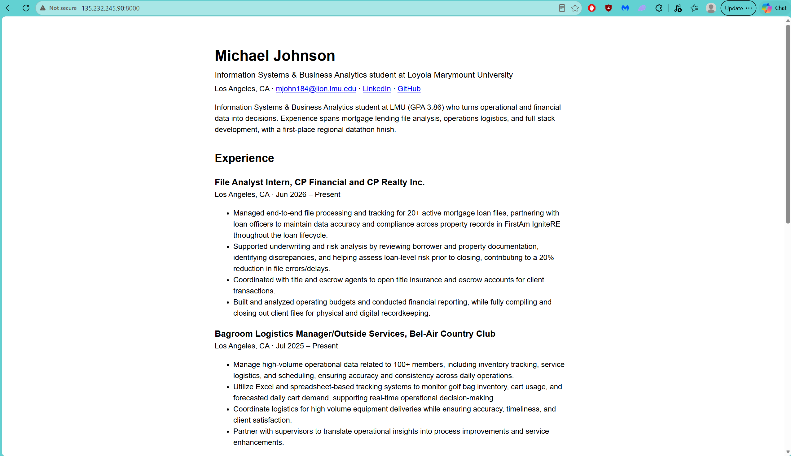

# Exercise 03: Migrate the resume site to an Azure VM

Full step-by-step record, with a check and an undo for each step: [`docs/superpowers/plans/2026-09-24-azure-vm-migration.md`](../superpowers/plans/2026-09-24-azure-vm-migration.md)

## 1. The VM

| | |
| --- | --- |
| VM name | `vm-career-platform` |
| Resource group | `rg-career-platform` |
| Region | North Central US (`northcentralus`) |
| Size | `Standard_B2ats_v2` (2 vCPU, 1 GiB RAM) |
| Image | Ubuntu Server 24.04 LTS, x64 Gen2 |
| Public IP | `135.232.245.90` |
| Login | `azureuser` with an SSH key; password login disabled |
| Firewall | One inbound rule, `Allow-SSH-Laptop`: TCP 22 from my laptop's address only (`/32`) |
| App | Next.js under systemd, listening on `127.0.0.1:8000` |
| Tags | `course=isba-4775`, `environment=staging` |
| Cost controls | Auto-shutdown 6:00 PM Pacific with an email warning; boot diagnostics off |

## 2. My site on the VM's public IP

Screenshot of the site during section 6 when the inbound rule was added. Both locks were closed prior to the screenshot.

## 3. What went wrong, and how it was fixed

**The guide's region and size weren't allowed on my subscription.**
- *What happened:* Creating the VM in West US 2 failed with `RequestDisallowedByAzure`.
- *How we investigated:* `az policy assignment list` showed an "Allowed resource deployment regions" policy on Azure for Students. The allowed regions were `northcentralus`, `westus`, `denmarkeast`, `mexicocentral` and `francecentral`.
- *The fix:* `az vm list-skus` showed `Standard_B2ts_v2` isn't offered to my subscription in North Central US. The Azure Retail Prices API showed `Standard_B2ats_v2` was the cheapest x64 size there with the same 2 vCPU and 1 GiB.
- *What confirmed it:* the deployment showed `Succeeded`, and `az vm show` returned `VM running`.

**The app was reading a different database file than the scripts were writing.**
- *What happened:* The app looked for `CAREER_PLATFORM_DB_PATH` / `data/app.db`, while the migrate and seed scripts, `.env.example` and Docker Compose all used `DATABASE_PATH` / `data/career-platform.sqlite`. The site would have read an empty database and quietly fallen back to the built-in snapshot.
- *How we found it:* searching the repo for every database path.
- *The fix:* commit `cf8324b` made the app read `DATABASE_PATH`.
- *What confirmed it:* on the VM, the app's own content service printed `database Michael Johnson`, not `snapshot`.

**SSH timed out twice.**
- *First time:* the 6 PM auto-shutdown had deallocated the VM between steps. `az vm show` said `VM deallocated`, and `az vm start` fixed it. Everything installed earlier was still on the disk, and the swap file came back on by itself.
- *Second time:* I'd moved from campus to home, so my laptop's public IP no longer matched the `/32` source of `Allow-SSH-Laptop`. Comparing `curl https://api.ipify.org` with the rule's source showed the mismatch. I updated the rule's source to my new address in the portal, and SSH connected again.

**Smaller issues:**
- **Auto-shutdown needed a resource provider:** it required `Microsoft.DevTestLab`, which wasn't registered on the subscription. The agent registered it, as the portal would have done automatically.
- **Public IP not deleted with the VM:** Azure ignored that setting because the VM's network interface was created separately by the CLI. Deleting the resource group still removes everything.
- **`npm install` rewrote the lock file:** on the laptop it removed some `libc` fields from `package-lock.json`. I restored the committed lock file, and the VM used `npm ci`, which installs exactly what the lock file says and never changes it.
- **The home page couldn't prove the data moved:** the original home page was a static scaffold, so the live server never read the database. I added a home page that renders my profile from the content service on every request (commit `28bd532`). One check then reported 0 open database handles, but only because `pgrep -f next-server` had matched my own SSH command. Listing the service's real processes from its cgroup showed `next-server` holding `data/career-platform.sqlite` open.
- **Ubuntu's Node.js was too old:** Ubuntu 24.04 ships Node 18, so Node 22 came from NodeSource to match the laptop.

**Decisions the agent made that I approved along the way:**
- **Region and size:** changing them, per my instruction to find the cheapest option that works.
- **systemd today:** using it instead of `nohup`.
- **Port 8000:** running the app on 8000 instead of Next.js's default 3000, so the guide's steps work as written.

**Data provenance:** seed data, not migrated data. The Codespace database was empty. I replaced the demo profile with my resume on the laptop, then copied that database to the VM.

**Checks that show the migration worked:**
- the same commit ID on laptop and VM (`28bd532`)
- the running `next-server` holds the copied database open, and the page shows my name
- identical SHA-256 hashes for the database file
- `PRAGMA integrity_check` returned `ok` on both
- matching row counts
- the content service printed `database Michael Johnson`
- the site came back by itself after `az vm restart`

## 4. The change

At the coffee shop my laptop has a different public IP than the one in my `Allow-SSH-Laptop` rule. That rule only allows my old address with `/32` which is why it hangs instead of being refused. I'd first confirm that the VM is up and running with `az vm show`. Then I would use ifcongig.me to check my current IP, and change the rule's source to that address. It doesn't cost much. Only a few minutes and a rule I have to change back. There are some security implications however, because while it's open, anyone on that shared Wi-Fi can at least attempt to connect, although they'd still need my private key.
